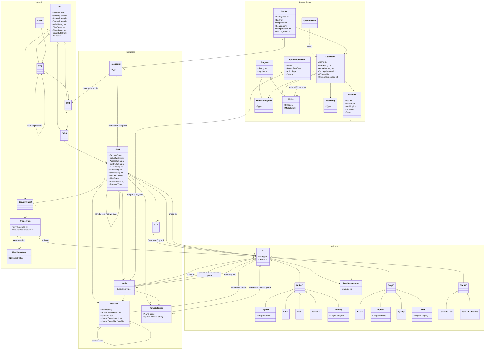
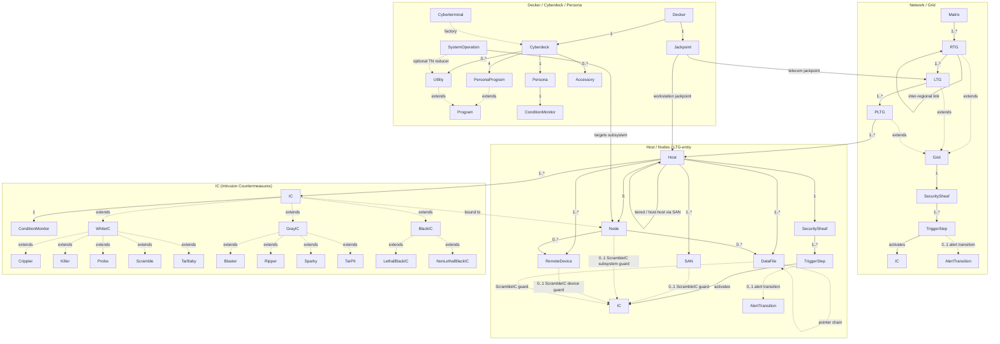

# Object Model

## Network Infrastructure

**Matrix** — root of the game engine; the world telecommunications network experienced as graphical virtual reality via ASIST/DNI.

**Grid** (abstract base; subtypes: RTG, LTG, PLTG)

- Security Code: Blue | Green | Orange | Red
- Security Value: integer (4–12+)
- Subsystem Ratings: Access, Control, Index, Files, Slave
- Security Tally: running total of host successes against the decker
- Alert Status: No Alert | Passive Alert | Active Alert

**RTG (Regional Telecommunication Grid)** — largest grid type; covers entire countries/regions.

**LTG (Local Telecommunication Grid)** — covers cities/neighborhoods; references parent RTG. Ratings normally equal parent RTG.

**PLTG (Private LTG)** — private/corporate grid; closed to the public; runs on dedicated fiber-optic lines; governed by owner's laws; carries security flags from the parent RTG.

**Host** — a single computer system; appears as buildings or large structures in the Matrix.

- Security Code + Security Value
- Subsystem Ratings: Access, Control, Index, Files, Slave
- Intrusion Difficulty: Easy | Average | Hard
- Topology Type: Open Access | Tiered | Host-Host | Private Grid
- Security Sheaf (ordered list of TriggerSteps)
- Alert Status: No Alert | Passive Alert | Active Alert
- Security Tally
- Reset timing (varies by Security Code)

**SAN (System Access Node)** — entry-point icon connecting a host to a grid or to another host; the first icon a decker encounters when logging on.

- May be protected by Scramble IC

**Node** — a subsystem within a host (e.g., CPU node, slave controller, I/O port).

- Subsystem type: Access | Control | Index | Files | Slave

**SecuritySheaf** — the complete security configuration of a host or grid.

- Ordered list of TriggerSteps (security tally threshold → IC activation or alert transition)
- If a single security tally accumulation reaches or exceeds two or more trigger steps at once, all triggered steps fire simultaneously.

**Jackpoint** — physical access point used to enter the Matrix.

- Type: legal-access | illegal-access | workstation | console | remote-device | telecom | illegal junction-box
- Connects to: an LTG or directly to a Host

**RemoteDevice** — a slave-controlled physical device connected to a host's Slave subsystem.

- Name
- SystemAddress: string — unique identifier within the Slave subsystem
- (Device kind labels such as Camera, Door, Elevator, MedicalScanner are free-form strings, not a typed enum)

**DataFile** — stored data on a host; may be scramble-protected or a pointer to data on another host.

- Name
- ScrambleProtected: bool — file is guarded by a Scramble IC program
- IsPointer: bool — file contains only a reference to data stored on another host
- PointerTargetHost: Host? — the host where the actual data resides (non-null when IsPointer = true)
- PointerTargetFile: DataFile? — the specific file on the target host (may be another pointer, forming a chain)

### Implementation Notes

**Equality semantics:** RTG, LTG, PLTG, Host, and DataFile are Kotlin data classes whose generated equals/hashCode/toString have been overridden to prevent unbounded recursion over the graph structure. Equality is based on the name field alone for RTG, LTG, PLTG, and Host. For DataFile, equality is based on name, isScrambleProtected, and sizeMp (pointerToHost and pointerTargetFile are excluded to prevent recursive equality). The copy() method is unaffected and continues to work normally.

---

## Decker

**Decker** — the character who operates in the Matrix.

- Intelligence
- Body
- Willpower
- Reaction
- Computer Skill (optional Decking specialization)
- Hacking Pool = floor((Intelligence + MPCP) ÷ 3); may be added to any Matrix test except Body/Willpower tests resisting gray or black IC physical damage
- Physical Condition Monitor (10 boxes)
- Mental Condition Monitor (10 boxes)
- Suppressed IC list — crashed IC programs held to prevent tally increase; each entry reduces Detection Factor by 1

**Cyberdeck** — the hardware a decker uses to enter the Matrix.

- MPCP Rating: master OS; caps individual persona program ratings; max total persona ratings = MPCP × 3
- Hardening: reduces Power of Black IC damage; raises target numbers for Gray IC tests
- Active Memory (Mp): limits how many utilities run simultaneously
- Storage Memory (Mp): stores all utilities and downloaded data; caps download size
- I/O Speed (Mp per Combat Turn): upload/download rate
- Response Increase (0–3 points; max = MPCP ÷ 4): each point adds +2 Reaction and +1D6 Initiative
- Detection Factor = (Masking + Sleaze) ÷ 2 rounded up; or Masking ÷ 2 if no Sleaze running
- Cost (nuyen)

**Cyberterminal ("Tortoise")** — limited cyberdeck configured for non-combat use; not a Cyberdeck subclass. Constructed via a factory function that returns a `Cyberdeck` with constrained parameters (`Cyberdeck` is a `data class` and therefore final in Kotlin).

- Max MPCP 4; no Response Increase available
- All programs run at –1 Rating
- User cannot be harmed by Black IC or Dump Shock

**Persona** — the decker's on-line icon; runs on Matrix computers.

- Bod (driven by Bod persona program)
- Evasion (driven by Evasion persona program)
- Masking (driven by Masking persona program)
- Sensor (driven by Sensor persona program)
- Condition Monitor (10 boxes)
- Status: Legitimate | Intruding

---

## Programs

**Program** (abstract base)

- Rating
- Mp size = Rating² × Multiplier

**PersonaProgram** (extends Program) — defines one persona attribute.

- Type: Bod | Evasion | Masking | Sensors
- Constraint: Rating ≤ MPCP; sum of all four persona program ratings ≤ MPCP × 3

**Utility** (extends Program) — operational tools loaded into active memory.

- Category: Operational | Special | Offensive | Defensive
- Multiplier (determines Mp size per Rating)
- Operational utilities (reduce System Test target numbers): Analyze (×3), Browse (×1), Commlink (×1), Deception (×2), Decrypt (×1), Read/Write (×2), Relocate (×2), Scanner (×3), Spoof (×3)
- Special utilities: Sleaze (×3), Track (×8)
- Offensive utilities: Attack (×2/3/4/5 by damage level), Black Hammer (×20), Killjoy (×10), Slow (×4)
- Defensive utilities: Armor (×3), Cloak (×3), Lock-On (×3), Medic (×4)

---

## IC (Intrusion Countermeasures)

**IC** (abstract base) — color is expressed by the sealed class hierarchy (WhiteIC / GrayIC / BlackIC), not as an explicit field.

- Rating
- Behavior: Proactive | Reactive
- Initiative = NxD6 + IC Rating (N = 1/2/3/4 for Blue/Green/Orange/Red hosts)

**White IC** — attacks the persona icon only; cannot permanently damage the decker or deck.

**Crippler** (extends WhiteIC) — degrades one specific persona attribute rather than dealing condition monitor damage.

- TargetAttribute: Bod (Acid variant) | Evasion (Binder variant) | Sensor (Jammer variant) | Masking (Marker variant)

**Killer** (extends WhiteIC) — standard attack IC; inflicts damage on the persona's condition monitor.

**Probe** (extends WhiteIC) — reactive, non-combat; tests for illegal icons and raises the security tally when it detects an intruder.

**Scramble** (extends WhiteIC) — reactive, placement IC; encrypts and guards a protected resource; destroys guarded data rather than allowing unauthorized access.

**TarBaby** (extends WhiteIC) — reactive; pre-programmed against one utility category; locks the targeted utility, preventing the decker from using it until the IC is defeated.

- TargetCategory: Operational | Offensive | Defensive | Special

**Gray IC** — attacks the cyberdeck and utilities; causes permanent deck damage.

**Blaster** (extends GrayIC) — standard attack IC; damages cyberdeck hardware (permanent equipment damage).

**Ripper** (extends GrayIC) — degrades one specific persona attribute and permanently damages the corresponding persona program on the deck.

- TargetAttribute: Bod (Acid-Rip variant) | Evasion (Bind-Rip variant) | Sensor (Jam-Rip variant) | Masking (Mark-Rip variant)

**Sparky** (extends GrayIC) — delivers electrical feedback through the ASIST link; damages cyberdeck hardware and may fry utilities.

**TarPit** (extends GrayIC) — reactive; pre-programmed against one utility category; locks the targeted utility and causes permanent program damage.

- TargetCategory: Operational | Offensive | Defensive | Special

**Black IC** — attacks the decker's physical body via ASIST biofeedback; can kill or permanently injure.

**LethalBlackIC** (extends BlackIC) — inflicts Physical damage directly on the decker's body; resisted by Body + Hardening.

**NonLethalBlackIC** (extends BlackIC) — inflicts Stun/Mental damage on the decker; resisted by Willpower + Hardening.

> Note: `Black Hammer` and `Killjoy` are Offensive Utility programs wielded by deckers, not IC programs.

---

## System Operations

**SystemOperation** — an action a decker performs while in the Matrix.

- Name
- System Test type: Access | Control | Index | Files | Slave
- Associated Utility (optional; reduces target number when loaded)
- Action type: Free | Simple | Complex
- Category: Standard | Interrogation | Ongoing | Monitored

Named operations (27 total): Analyze Host, Analyze IC, Analyze Icon, Analyze Security, Analyze Subsystem, Control Slave, Decrypt Access, Decrypt File, Decrypt Slave, Download Data, Edit File, Edit Slave, Graceful Logoff, Locate Access Node, Locate Decker, Locate File, Locate IC, Locate Slave, Logon to Host, Logon to LTG, Logon to RTG, Make Comcall, Monitor Slave, Null Operation, Relocate Icon, Tap Comcall, Upload Data.

---

## Combat

**CombatTurn** — 3-second round; structured by Initiative order.

### Initiative

- Decker: Reaction + 1D6 (+ Response Increase bonuses)
- IC: NxD6 + IC Rating (N determined by host Security Code)

**CombatManeuver** — Simple Action taken during cybercombat.

- Types: Evade Detection, Parry Attack, Position Attack
- Resolved as opposed Evasion vs. Sensor test

**DamageLevel** — Light | Moderate | Serious | Deadly

**ConditionMonitor** — 10 boxes; tracks damage to an icon or (separately) to the decker's physical/mental state.

**DumpShock** — Stun damage suffered on involuntary jack-out or persona crash.

- Power = host Security Value; Level determined by Security Code

**SimsenseOverload** — Stun damage to decker's physical body from White/Gray IC hits; resisted by Willpower test.

---

## Accessories

**Accessory** — physical add-ons to a cyberdeck or datajack setup.

- Types: Off-line storage (external to deck), Vid-screen display, Hitcher jack (allows passive observers via electrodes or datajack feed; observers cannot be harmed by IC)

---

## Relationships

### Network Topology

- **Matrix → RTG** (1:many) — The Matrix is the root; it contains all RTGs. Every RTG belongs to exactly one Matrix.
- **RTG → LTG** (1:many) — Each RTG contains one or more LTGs. An LTG's System Ratings equal those of its parent RTG by default. A decker switching between LTGs within the same RTG retains the same SecurityTally.
- **RTG ↔ RTG** (many:many) — RTGs are linked to each other for inter-regional routing; a decker uses a Logon to RTG operation to cross between them. Moving to a different RTG resets the SecurityTally.
- **LTG → PLTG** (0:many, entry points) — A PLTG may attach to one or more public LTGs as entry points. Conversely, an LTG may have zero or more PLTGs accessible from it (via Logon to LTG operation from the LTG).
- **PLTG → Host** (1:many) — A PLTG contains hosts; once a decker is on the PLTG they can access any host connected to it.
- **PLTG inherits SecurityTally from RTG** — When a decker enters a PLTG from a public RTG/LTG, the RTG's accumulated tally carries over ("security flags"); IC may trigger on entry.
- **Grid → SecuritySheaf** (1:1) — Every Grid (RTG, LTG, PLTG) has its own SecuritySheaf governing how it reacts to intruders.

### Host Connections

- **Host → Grid via SAN** (many:1, open-access topology) — A host with open access connects to exactly one LTG or PLTG via a SAN; the SAN is the first icon a decker encounters when logging on.
- **Host → Host via SAN (tiered topology)** (many:many) — A first-tier host is the sole gateway to one or more second-tier hosts. A decker must pass through the first-tier host to reach any second-tier host; to move between second-tier hosts the decker must re-enter the first-tier host.
- **Host → Host via SAN (host-host topology)** (many:many) — Peer hosts are linked directly to one another; a decker traverses the chain (e.g., B → C → D → E) to reach deeper hosts.
- **Host → SAN** (1:1..many) — Each distinct connection point (to a grid or to another host) is represented by a separate SAN icon on the host. A multi-homed host has multiple SANs.
- **Host → Node** (1:5) — A host contains exactly five Nodes, one per subsystem type: Access, Control, Index, Files, and Slave.
- **Host → SecuritySheaf** (1:1) — A host owns one SecuritySheaf.
- **Host → IC** (1:many) — A host owns all IC programs within it. The host's Security Value is the dice pool for IC Attack Tests and IC Damage Resistance Tests.
- **Host → DataFile** (1:many) — DataFiles reside on a host (primarily in the Files node).
- **Host → RemoteDevice** (1:many) — Physical devices are controlled via the host's Slave subsystem/node.
- **Host → AlertStatus** (1:1) — The host tracks its current alert state (No Alert → Passive Alert → Active Alert); Passive Alert raises all Subsystem Ratings by 2.

### SAN

- **SAN → Host** (many:1) — A SAN is the entry icon for its host; a decker performing Logon to Host enters through this icon.
- **SAN is visible from** the Grid (or parent host) it is attached to — it appears as an icon in that space.
- **SAN → ScrambleIC** (0:1) — A SAN may be protected by a Scramble IC program; the decker must succeed at a Decrypt Access operation before the Logon to Host is possible.

### Node

- **Node → Host** (many:1) — Each node belongs to exactly one host.
- **Node → IC** (0:many, reactive guard) — Reactive IC may be bound to a specific node/subsystem; it triggers when a decker accesses that node.
- **Node → ScrambleIC** (0:1) — A Scramble IC program may guard an entire subsystem node; it then blocks all operations targeting that subsystem (e.g., all Files operations, all Slave operations, or logons from specific Access entry points) until decrypted.
- **Node → DataFile** (0:many) — Files are logically stored within the Files node (accessible via the Files subsystem).
- **Node → RemoteDevice** (0:many) — Remote devices are accessed through the Slave node.
- **Persona ↔ Node (current location)** — An active persona is always located in exactly one node of the currently accessed host (or on the grid); cybercombat and IC interactions occur at this location.

### SecuritySheaf and SecurityTally

- **SecuritySheaf → TriggerStep** (1:many, ordered) — A sheaf is an ordered list of TriggerSteps; step intervals are determined by the host/grid SecurityCode (Red = tightest spacing, Blue = widest).
- **TriggerStep → IC activation** (1:many events) — When the decker's SecurityTally reaches or exceeds a trigger threshold, the host activates one or more IC programs listed for that step.
- **TriggerStep → AlertTransition** (0:1) — Specific trigger steps flip the host's AlertStatus to Passive Alert or Active Alert.
- **SecurityTally is per (Decker × Host/Grid)** — Each decker accumulates a separate tally on each host/grid. The tally persists through the run and resets according to SecurityCode (Blue resets fastest; Red slowest). Crashing IC adds the IC's Rating to the tally unless the decker suppresses the crashed IC (CC-22). A decker who enters a host while its tally is mid-reset starts at the tally's current reduced value, not at 0.

### Decker, Cyberdeck, and Persona

- **Decker → Cyberdeck** (1:1 during a run) — Only one decker can jack into a cyberdeck at a time; the decker is physically connected via datajack or electrode net.
- **Decker → Jackpoint** (1:1 during a run) — A decker enters the Matrix through exactly one jackpoint.
- **Jackpoint → LTG** (many:1, telecom/illegal-junction-box type) — Telecom jackpoints connect the decker directly to an LTG; the persona appears on that LTG.
- **Jackpoint → Host** (many:1, workstation/console/remote-device type) — These jackpoints bypass the grid entirely and connect straight to a host (Logon to Host is the only available first operation).
- **Cyberdeck → Persona** (1:1) — The cyberdeck generates exactly one persona. The persona is a program running on the Matrix computers; the deck is the front-end that converts neural impulses into Matrix transactions.
- **Cyberdeck → PersonaProgram** (1:4, exactly) — The four PersonaPrograms (Bod, Evasion, Masking, Sensors) define the Persona's attributes. Each Rating ≤ MPCP; sum of all four ≤ MPCP × 3.
- **Cyberdeck → Utility (Active Memory)** (1:many, capacity-limited) — Utilities loaded into Active Memory are runnable. Total Mp of active utilities ≤ Active Memory rating of the deck.
- **Cyberdeck → Utility (Storage Memory)** (1:many, capacity-limited) — All utilities must be stored in Storage Memory whether active or not. Total Mp of all stored utilities + downloaded data ≤ Storage Memory rating.
- **Cyberdeck → Accessory** (1:many) — Optional physical add-ons: off-line storage, vid-screen display, hitcher jack.
- **Persona → ConditionMonitor** (1:1, 10 boxes) — The persona has its own condition monitor separate from the decker's physical/mental monitors.
- **Persona attributes derived from PersonaPrograms** — Bod, Evasion, Masking, and Sensor ratings are read directly from the four PersonaProgram ratings running on the deck.

### Security Decker (NPC)

- **Host → SecurityDecker Persona** (0:many, Active Alert) — Under Active Alert a TriggerStep may spawn one or more corporate/law-enforcement security deckers whose Personas enter the host and operate in the same nodes as the intruder.

### IC

- **IC → Host** (many:1) — Every IC program belongs to exactly one host; the host's Security Value is the dice pool for all IC Attack Tests and Damage Resistance Tests.
- **IC → Node (current location)** (0:1) — Reactive IC is bound to a specific node/resource. Proactive IC is host-level and acts in the same node as its target persona.
- **IC → ConditionMonitor** (1:1) — IC has a condition monitor (damage tracked using the host's Security Value dice).
- **White IC attacks Persona** — White IC targets only the persona's condition monitor; it cannot damage the cyberdeck or the decker's physical body.
- **Gray IC attacks Cyberdeck/Utilities** — Gray IC targets the cyberdeck hardware and loaded utilities, causing permanent equipment damage.
- **Black IC attacks Decker (physical/mental)** — Black IC uses ASIST biofeedback to inflict Physical (lethal subtype) or Stun/Mental (non-lethal subtype) damage directly on the decker's body.

### DataFile

- **DataFile → Host** (many:1) — A file is stored on one host (primarily in the Files node).
- **DataFile → DataFile (pointer chain)** (0:1) — A file may be a pointer referencing a file on another connected host, creating a distributed database chain. A decker may traverse several hosts to reach the actual data (gamemaster rolls 1D6 for chain length).
- **DataFile → ScrambleIC** (0:1) — A file may be protected by Scramble IC; the decker must perform Decrypt File before downloading or editing it.

### RemoteDevice

- **RemoteDevice → Host** (many:1) — A remote device is owned by the host whose Slave subsystem controls it.
- **RemoteDevice → Node** (many:1) — Remote devices are accessed and controlled through the host's Slave node.
- **RemoteDevice → ScrambleIC** (0:1) — A specific remote device may be individually protected by a Scramble IC; the decker must succeed at Decrypt Slave before controlling, editing, or monitoring that device.

### SystemOperation

- **SystemOperation targets a Subsystem/Node** (many:1) — Every operation is affiliated with exactly one subsystem (Access, Control, Index, Files, or Slave); the corresponding Subsystem Rating is the target number for the System Test.
- **SystemOperation → Utility** (0:1, optional) — Each operation lists an associated utility; when that utility is loaded in Active Memory it reduces the System Test target number.
- **SystemOperation actor: Persona** — Only a persona (player decker or security decker NPC) can execute system operations; the persona must be on the host/grid that owns the targeted resource.

---

## Entity Relationship Diagram

## Entity Relationship Diagram (entities only)

